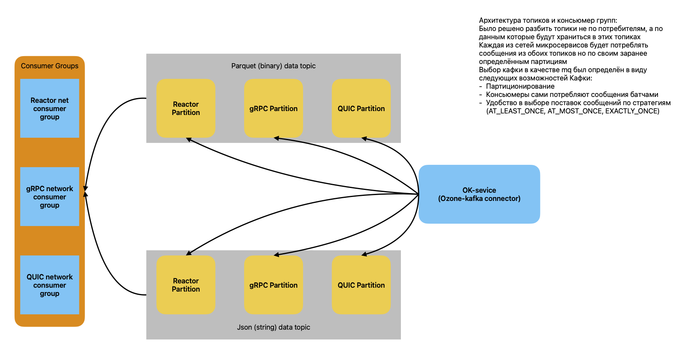

# Apache Ozone to Kafka Connector Service

## 📋 Описание проекта
Данное приложение реализует передачу данных из [Apache Ozone](https://ozone.apache.org/) в [Apache Kafka](https://kafka.apache.org/). Оно позволяет эффективно извлекать данные из распределенного хранилища Ozone и отправлять их в Kafka для последующей обработки.

---

## 🏗 Архитектура



Архитектура проекта описана в файле [broker_arch.pdf](broker_arch.pdf), включающем следующие основные компоненты:
1. **Apache Ozone**: Источник данных.
2. **Ozone to Kafka Connector Service**: Приложение, которое обрабатывает данные:
    - Извлекает их из Ozone.
    - Преобразует (если требуется).
    - Отправляет топики и партиции Kafka.
3. **Apache Kafka**: Система для передачи потоковых данных.
4. **Консюмеры Kafka**: Сервисы, обрабатывающие или сохраняющие данные.

---

## 🚀 Технологический стек

- **Язык программирования**: Java (Spring Boot)
- **Хранилище**: Apache Ozone
- **Передача данных**: Apache Kafka
- **Логирование**: Logback/SLF4J
- **Сборка проекта**: Gradle

---

## 🛠 Инструкция по запуску

### 🔧 Предварительные требования
Перед запуском убедитесь, что у вас установлены:
1. **Java 17** или выше.
2. **Gradle** для сборки проекта.
3. Развернутые кластеры:
    - Apache Ozone, порт om (порт 9862 по умолчанию).
    - Apache Kafka (порт 8092 по умолчанию).

### 📥 Сборка проекта
Клонируйте репозиторий и выполните команду сборки:
```bash
git clone https://github.com/your-repo/ozone-to-kafka.git
cd ozone-to-kafka
./gradlew clean assemble
```